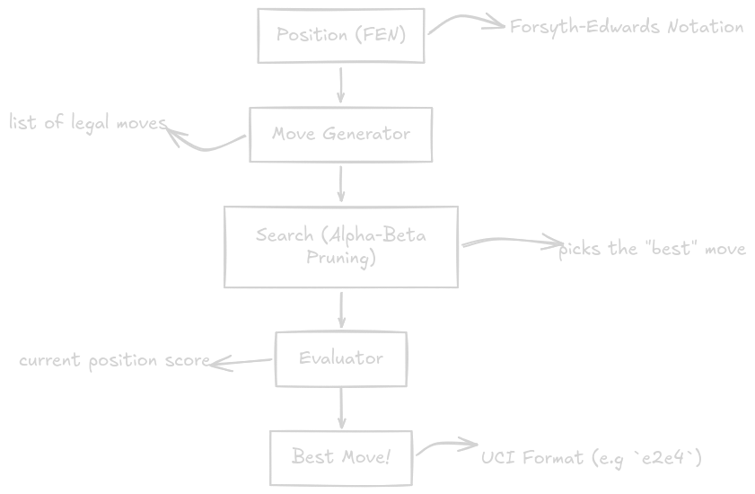
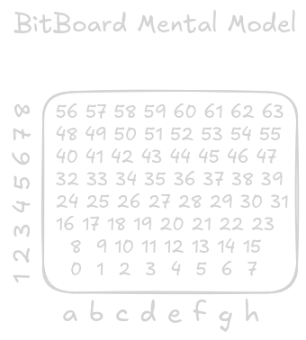
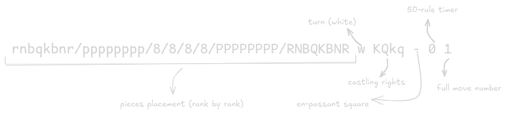
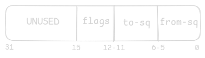
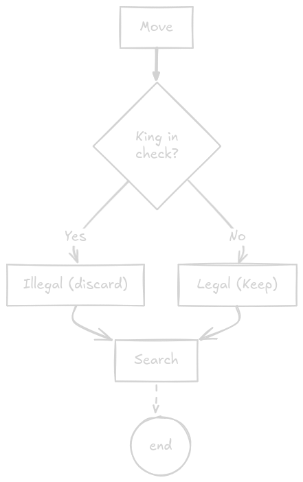
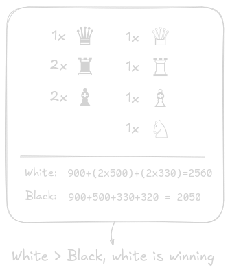
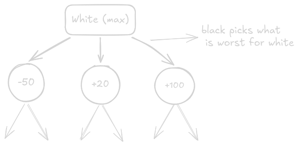

# Kejsare

This is an implementation of chess engine *kejsare* using `Go` programming language.
But I'm going to go through all the steps (fundamentally, programmaticly, etc) to help you understand the whole idea of a chess engine.

---

# Engine Architecture

Before going into coding stuff, let's understand the data flow:




> Each one of these components is a distinct responsibility, so each gets its own Go `package`

---
## Position

The board is the single source of truth. It answers: *what pieces are where, whose turn is it, can white still castle?* 

We represent it using **bitboards**. A chessboard has 64 squares, a `uint64` has 64 bits, perfect fit. Each bit being `1` means a piece of that type occupies that square.



The board state is loaded from a **FEN string**: a standard notation that encodes the full game state in one line:


---

## Move Generator

### The Move Struct

Before generating moves, we need to define what a move **is**. Every move needs to encode:

- Where the piece is coming **from**
- Where it's going **to**
- Any **special** information (promotion, castling, en passant)

**Encoding a move in one `uint32`:**

Here's our bit layout:



**Flags:**
```
0000 = quiet move
0001 = double pawn push
0010 = king castle
0011 = queen castle
0100 = capture
0101 = en passant capture
1000 = knight promotion
1001 = bishop promotion
1010 = rook promotion
1011 = queen promotion
1100 = knight promotion + capture
1101 = bishop promotion + capture
1110 = rook promotion + capture
1111 = queen promotion + capture
```


### The Move Generator Itself

This is the biggest and most complex part of the engine. I'll build it in stages, starting with the simplest pieces and working up.

**What I'm building:**

`generator.go` takes a `*Board` and returns `[]moves.Move`, which is **every legal move in that position**.

I'll generate moves for each piece type:
1. **Pawns** (Most special cases)
2. **Knights** (Simplest)
3. **Bishops and Rooks** (Sliding pieces)
4. **Queens** (Just combine bishop and rook movement)
5. **Kings** (castling)

### Pawns

Pawns are the most complex piece to generate for despite being the weakest. They have asymmetric movement (white goes up, black goes down), attack diagonally but move straight, and have four special cases:

- **Single push**: one square forward if the square is empty 
- **Double push**: two squares from the starting rank if both squares are empty
- **Captures**: diagonal only, only if an enemy piece is there 
- **En passant**: capture a pawn that just double-pushed, landing on the skipped square
- **Promotion**: reaching the back rank replaces the pawn with any piece
 
All of this is computed with bitwise shifts on the pawn bitboard rather than looping over individual pawns:

```go 
// white single push: shift all pawns up one rank
 singlePush := (pawns << 8) & empty 
```

### Knights

Knights are the simplest to generate — they jump in an L-shape and ignore blocking pieces entirely. All 8 jump targets are computed with bitwise shifts:
```go 
func knightAttacks(bb Bitboard) Bitboard {
 return (bb<<17)&^FileA | // up 2, right 1 
 (bb<<15)&^FileH | // up 2, left 1
 (bb<<10)&^(FileA|FileB) | // up 1, right 2 
 ... 
 } 
``` 

The file masks (`&^FileA`, `&^FileH`) prevent wrap-around — a knight on h1 shifting left 17 bits would otherwise land on a4, which is wrong.

### Bishops, Rooks, and Queens

Now sliding pieces: *bishops, rooks, and queens*. These are trickier than knights because they can be **blocked** by other pieces mid-ray.

### The Blocking Problem
A knight jumps, it doesn't care what's in between. A rook slides, it stops when it hits a piece.

### Approach: Ray-Casting

For each direction, shift the piece bitboard repeatedly until we hit the edge or a blocker. We'll use a clean helper called `rayAttacks`.

### Legality Filter

To produce a filter that generate a **legal set of moves,** where it consider our king possible check:



---

## Evaluator

The evaluator scores a position from white's perspective. 
- Positive = white winning
- Negative = black winning
- 0 = equal

Let's begin with just simple material count. We count pieces and multiply them by their ***centipawns*** value:




---

## Search 

Search is the brain of the engine. Everything we've built so far feeds into this.

### How Search Works

We explore the game tree recursively. White picks the move that leads to the highest score, black picks the move that leads to the lowest. This is ***Minimax***:*



